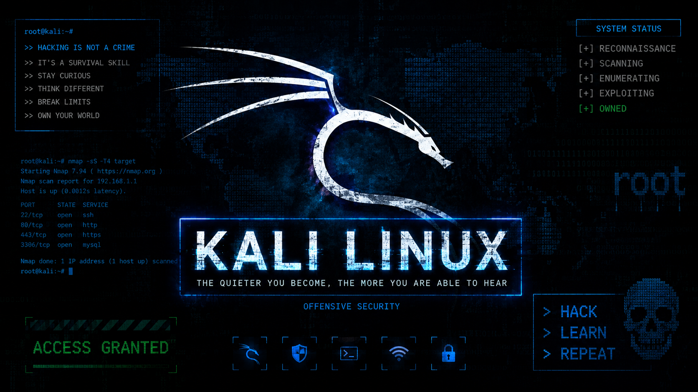

<div align="center">



# Kali Linux Tools - The Complete Learning Repository

### From Zero to Expert - Master Every Tool, Every Technique

[](https://attack.mitre.org/)
[](#tool-list)
[](#)
[](#phase-01--reconnaissance)
[](#phase-02--resource-development)
[](#roadmap)
[](LICENSE)
[](CONTRIBUTING.md)

---

**The most comprehensive, structured educational resource for Kali Linux cybersecurity tools.**

432+ tools documented from zero to master, organized by the MITRE ATT&CK framework.
Every tool gets a full 8-chapter guide with real examples, not just a man page reprint.

**Star this repo if it helps you learn** - it keeps the project going.

</div>

---

## Why This Repo?

Most Kali tool docs are either too shallow (a few commands) or too scattered (random blog posts). This repo takes a different approach:

- **Structured learning path** - follow MITRE ATT&CK phases in order
- **8-chapter template per tool** - intro, install, basic, intermediate, advanced, scenarios, defense, troubleshooting
- **Real command examples** - every command has an explanation, not just a flag dump
- **Beginner to advanced** - each tool starts simple and builds up
- **CTF and bug bounty focused** - scenarios you'll actually encounter
- **Blue team included** - detection and defense sections for every tool
- **Consistent format** - every tool looks the same, so you always know where to find what

---

## What's Inside

| Phase | Name | Tools | Lines | Status |
|-------|------|-------|-------|--------|
| 01 | [Reconnaissance](01_reconnaissance/) | 80 | 75,606 | **Complete** |
| 02 | [Resource Development](02_resource_development/) | 34 | 21,292 | **Complete** |
| 03 | [Initial Access](03_initial_access/) | 10 | 10,488 | **Complete** |
| 04 | Execution | 6 | - | Developing |
| 05 | Persistence | 7 | - | Developing |
| 06 | Privilege Escalation | 6 | - | Developing |
| 07 | Defense Evasion | 16 | - | Developing |
| 08 | Credential Access | 52 | - | Developing |
| 09 | Discovery | 88 | - | Developing |
| 10 | Lateral Movement | 3 | - | Developing |
| 11 | Collection | 12 | - | Developing |
| 12 | Command and Control | 30 | - | Developing |
| 13 | Exfiltration | 3 | - | Developing |
| 14 | Impact | 10 | - | Developing |
| 15 | Forensics | 51 | - | Developing |
| 16 | Services and Other | 15 | - | Developing |

---

## Roadmap

```
[x] Phase 01 - Reconnaissance (80 tools) DONE
[x] Phase 02 - Resource Development (34 tools) DONE
[x] Phase 03 - Initial Access (10 tools) DONE
[ ] Phase 04 - Execution (6 tools)
[ ] Phase 05 - Persistence (7 tools)
[ ] Phase 06 - Privilege Escalation (6 tools)
[ ] Phase 07 - Defense Evasion (16 tools)
[ ] Phase 08 - Credential Access (52 tools)
[ ] Phase 09 - Discovery (88 tools)
[ ] Phase 10 - Lateral Movement (3 tools)
[ ] Phase 11 - Collection (12 tools)
[ ] Phase 12 - Command and Control (30 tools)
[ ] Phase 13 - Exfiltration (3 tools)
[ ] Phase 14 - Impact (10 tools)
[ ] Phase 15 - Forensics (51 tools)
[ ] Phase 16 - Services and Other (15 tools)
```

**Contributions welcome!** See [CONTRIBUTING.md](CONTRIBUTING.md) if you want to help document a tool.

---

## Phase 01 - Reconnaissance (Complete)

80 tools covering network scanning, web vulnerability assessment, OSINT, DNS enumeration, Bluetooth, WiFi, and radio frequency analysis.

### Top Tools by Documentation Depth

| Tool | Lines | What It Covers |
|------|-------|----------------|
| **Autorecon** | 3,631 | Automated network recon with service enumeration |
| **Amass** | 2,121 | In-depth attack surface mapping |
| **Metagoofil** | 2,076 | Public file metadata extraction |
| **EmailHarvester** | 1,893 | Email address enumeration |
| **Nmap** | 1,048 | Port scanning, service detection, OS fingerprinting |
| **Gobuster** | 1,182 | Directory and subdomain brute forcing |
| **Nuclei** | 1,249 | Template-based vulnerability scanning |
| **Burp Suite** | 1,079 | Web application security testing |
| **FFuf** | 1,143 | Fast web fuzzing |
| **Sherlock** | 613 | Username OSINT across 400+ platforms |

---

## Phase 02 - Resource Development (Complete)

34 tools for reverse engineering, exploit development, fuzzing, Android analysis, and payload generation.

### Top Tools

| Tool | Lines | What It Covers |
|------|-------|----------------|
| **MSFvenom** | 907 | Payload generation, encoders, output formats |
| **GDB** | 816 | GNU Debugger, breakpoints, memory inspection |
| **Ghidra** | 675 | NSA reverse engineering suite, decompilation |
| **AFL** | 602 | Coverage-guided fuzzing |
| **VEIL** | 603 | AV evasion payload generation |
| **Shellter** | 598 | Shellcode injection into PE files |
| **JADX** | 520 | Android APK decompilation |
| **Radare2** | 534 | Reverse engineering framework |

---

## How Every Tool Is Documented

Each tool follows a consistent 8-chapter structure:

```
tool-name.md
+-- Chapter 1: Introduction & Overview
|   +-- What is it?
|   +-- History & Background
|   +-- When to Use / When NOT to Use
|   +-- Key Concepts
+-- Chapter 2: Installation & Setup
|   +-- System Requirements
|   +-- Installation Methods (APT, Source, Docker)
|   +-- Verification
+-- Chapter 3: Basic Usage
|   +-- First Run (with sample output)
|   +-- Essential Commands (5-10+)
|   +-- COMPLETE Flag Reference Tables
+-- Chapter 4: Intermediate Usage
|   +-- Bash Scripting & Automation
|   +-- Python Scripting
|   +-- Tool Chaining
+-- Chapter 5: Advanced Usage
|   +-- Custom Techniques
|   +-- Evasion Techniques
|   +-- Pentest Workflow Integration
+-- Chapter 6: Real-World Scenarios
|   +-- Security Audit walkthrough
|   +-- CTF Challenge
|   +-- Bug Bounty
+-- Chapter 7: Detection & Defense
|   +-- How Defenders Detect It
|   +-- IDS/IPS Signatures
|   +-- Blue Team Response
+-- Chapter 8: Troubleshooting
    +-- Common Errors & Solutions
    +-- FAQ
```

Plus a **CHEATSHEET.md** in every tool directory for quick field reference.

---

## Getting Started

### For Learning
Start with Phase 01 tools in order. Each tool builds on the previous ones.

### For Quick Reference
Check the [CHEATSHEET.md](CHEATSHEET.md) for a consolidated quick-reference of all tools.

### For a Specific Tool
Navigate to the tool directory:
```
01_reconnaissance/03_network_information/nmap/nmap.md
```

---

## Who Is This For?

- **Students** learning cybersecurity and penetration testing
- **CTF players** looking for tool references during competitions
- **Bug bounty hunters** wanting comprehensive tool documentation
- **Pentesters** needing a quick reference for tools they don't use daily
- **Blue teamers** wanting to understand attacker tools for detection
- **OSCP/GPEN/CEH candidates** preparing for certifications
- **Anyone** who wants to learn Kali Linux tools from scratch

---

## Contributing

This project is actively developing. Contributions are welcome:

1. Pick a tool that needs documentation
2. Follow the 8-chapter template
3. Submit a pull request

See [CONTRIBUTING.md](CONTRIBUTING.md) for detailed guidelines.

---

## License

MIT License - see [LICENSE](LICENSE) for details.

Educational purposes only. Always get authorization before testing systems you don't own.

---

<div align="center">

### Star History

If this helps your learning, give it a star. It motivates more content.

**Phase 01: Done** | **Phase 02: Done** | **Phase 03: Done**

[Back to Top](#kali-linux-tools---the-complete-learning-repository)

</div>
